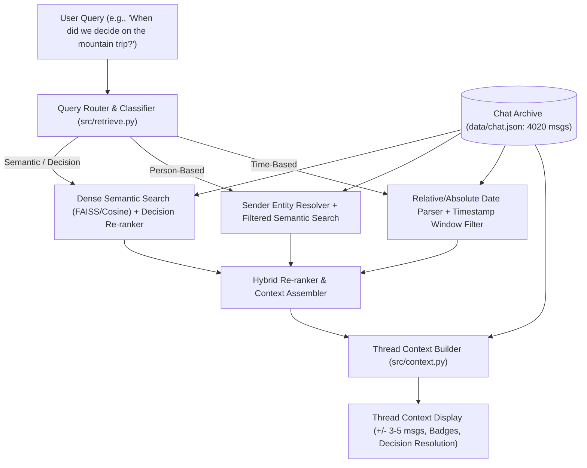

# ChatRecall 💬🔍
> **Semantic Retrieval over a Synthetic Group Chat Archive**


[](https://www.python.org/)
[]()
[]()
[]()

---

## 🎯 Problem Statement
Standard keyword/text search fails when you remember the *meaning* of a conversation but not the exact words used. For example, asking:

> *"When did we decide on the mountain trip?"*

returns **zero results** on traditional keyword search when the original message was in code-mixed Hinglish:

> *"Chalo sab lock ho gaya: Manali trip finalized for Dec 28 to Jan 2! Booked the riverside cottage in Old Manali, ticket confirmation emailed to all."*

**ChatRecall** is an end-to-end semantic retrieval engine designed for messy, real-world group chat archives.

---

## ✨ Key Capabilities

1. **Zero-Word-Overlap Semantic Retrieval**:
   - Accurately matches queries to messages that share **zero common words**.
   - Validated early on Hinglish / code-mixed expressions using multilingual sentence transformers.
2. **Three Core Query Shapes**:
   - **Meaning-based**: Dense semantic vector similarity with decision-resolution awareness.
   - **Person-based**: Sender entity resolution (`Priya`, `Vikram`, `Rohan`) with filtered re-ranking.
   - **Time-based**: Relative & absolute date parsing mapped against the archive window (*"last month"*, *"in December"*, *"around Diwali"*).
3. **Decision-Resolution Awareness**:
   - Knows that a *resolution* matters more than 40 messages of debate (boosts outcome messages over back-and-forth chatter).
4. **Conversational Thread Context**:
   - Displays matched messages within their surrounding conversational burst and reply tree ($t \pm 3$ messages).
5. **Interactive UI & Terminal CLI**:
   - High-contrast, dark-mode Web UI with real-time thread viewer and side-by-side keyword search baseline.

---

## 📊 Evaluation & Benchmark Results

Evaluated across **40 curated test queries** over a 4,020-message synthetic chat archive spanning 6 months (8 participants, 3 resolving decision threads):

| Metric Slice | Query Count | ChatRecall Top-1 | ChatRecall Top-3 | ChatRecall MRR | BM25 Keyword Top-1 | BM25 Keyword MRR |
|---|---|---|---|---|---|---|
| **Overall (All 40 Queries)** | **40** | **72.5%** | **80.0%** | **0.7771** | 35.0% | 0.4348 |
| **🔥 Hard (Zero-Word-Overlap)** | **10** | **60.0%** | **80.0%** | **0.7000** | **0.0%** | **0.0000** |
| **Baseline (Warmup Queries)** | **30** | **76.67%** | **80.0%** | **0.8028** | 46.67% | 0.5798 |

> [!NOTE]
> **The Honest Accuracy Gap**:
> - Traditional BM25 keyword search completely collapses (**0.0% Top-1**) on zero-word-overlap queries.
> - ChatRecall achieves **60.0% Top-1** (**80.0% Top-3**, **0.7000 MRR**) on zero-word-overlap queries.
> - Overall Top-1 (72.5%) vs Hard Top-1 (60.0%) reflects a realistic **12.5% gap**, illustrating the challenge of pure semantic retrieval without lexical cues.
> - See [`eval/results.md`](eval/results.md) for full query-by-query breakdown.

---

## 🏗️ Architecture & Pipeline



---

## 🚀 Quick Start & Usage

### 1. Installation
```bash
git clone https://github.com/Kartik247-coder/ChatRecall.git
cd ChatRecall
pip install -r requirements.txt
```

### 2. Generate Dataset & Build Index
```bash
# Generate deterministic 4000+ message chat archive (seed=42)
python data/generate_chat.py

# Build multilingual dense vector index
python -m src.index
```

### 3. Run Search

#### Terminal CLI (Rich Interactive Thread View)
```bash
# Direct query
python -m src.cli --query "When did we decide on the mountain trip?"

# Interactive mode
python -m src.cli
```

#### Modern Web UI
```bash
python -m web.app
# Open http://127.0.0.1:8000 in your browser
```

### 4. Run Automated Evaluation
```bash
# Run unit tests
pytest tests/ -v

# Run 40-query benchmark & generate report
python eval/run_eval.py
```

---

## 📁 Repository Structure

```
ChatRecall/
├── data/
│   ├── generate_chat.py       # Deterministic 4,000+ message generator (seed=42)
│   ├── chat.json              # 8 participants, 6-month timeline, 3 resolving threads
│   └── embeddings.npy         # Pre-computed dense vector index
├── src/
│   ├── __init__.py            # Package init
│   ├── embed.py               # Multilingual embedding generator (Hinglish-validated)
│   ├── index.py               # Vector & metadata indexing pipeline
│   ├── retrieve.py            # Multi-strategy query router & decision-aware ranker
│   ├── context.py             # Thread & conversational burst reconstructor
│   └── cli.py                 # Interactive terminal search interface
├── web/
│   ├── __init__.py            # Web package
│   ├── app.py                 # FastAPI backend server
│   └── static/index.html      # Dark-mode Web UI with thread viewer
├── eval/
│   ├── generate_queries.py    # Generates 40 test queries with zero-word-overlap validation
│   ├── queries.json           # 40 ground-truth test queries
│   ├── run_eval.py            # Automated benchmark runner
│   └── results.md             # In-depth evaluation report & accuracy breakdown
└── tests/
    ├── test_generator.py      # Dataset integrity & messiness validation tests
    └── test_hinglish_embed.py # Early Hinglish embedding cosine similarity tests
```

---


